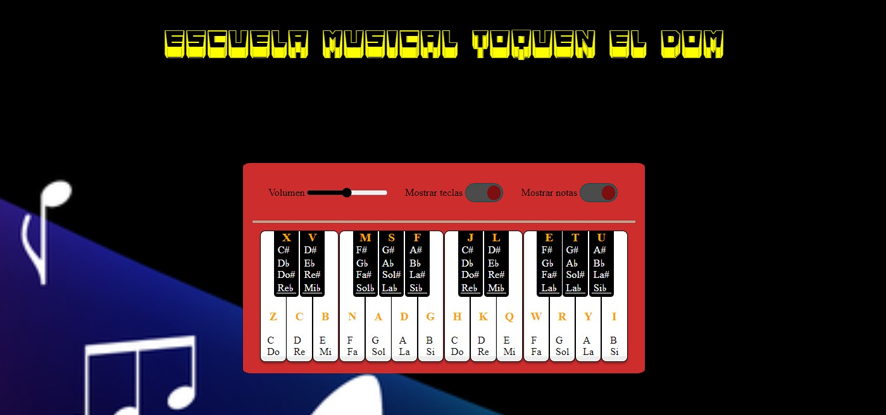
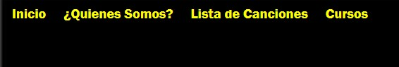

# PROYECTO_PIANO

Se ha creado una web para una escuela de música online “Toquen el DOM”, con un piano virtual en el que se puede practicar y desplegables con enlaces con tutoriales para piano, enlaces a canciones con ayudas para el teclado.
Se ha implementa el proyecto utilizando la metodología SCRUM con TRELLO.

Se ha creado un teclado virtual mediante HTML,  los estilos de las teclas se han creado mediante CSS y se han implementado las funciones del teclado mediante JavaScript. El teclado funciona con clic del ratón en las diferentes teclas del piano o con pulsaciones en las letras del teclado del ordenador, las teclas, las letras del teclado y las notas del piano cambian de color con los clics del ratón y con las pulsaciones en las letras del teclado del ordenador. También se ha colocado un botón para mostrar u ocultar las nomenclaturas de las teclas y otro botón para mostrar y ocultar las notas de las teclas

Se ha creado una Navbar mediante HTML, CSS y JavaScript, con menús desplegables que enlazan con:

Inicio,

Quienes somos: “Historia” Contactos”,

Canciones con ayudas para tocar el piano,

Cursos con tutoriales para aprender a tocar el piano.

Enlaces a canciones con ayudas para el teclado.

Enlaces con tutoriales para piano.

Enlaces con tutoriales para piano

Se ha creado un footer con información sobre la WEB y el proyecto 

